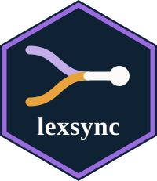

# lexsync <small>(R)</small> 

<!-- badges: start -->
[](https://github.com/pablobernabeu/lexsync/actions/workflows/R-CMD-check.yaml)
[](https://lifecycle.r-lib.org/articles/stages.html#experimental)
[](https://opensource.org/license/MIT)
<!-- badges: end -->

lexsync builds psycholinguistic stimulus sets and the experiments that present
them. Given a word-frequency corpus in any of dozens of languages and a short
design file, it selects items matched in parallel across several lexical
dimensions, counterbalances them across conditions and lists, and writes the
experiment that runs them on 'PsychoPy', 'OpenSesame' or in the browser through
'jsPsych'. The two laboratory targets carry electroencephalography triggers
bound to the buffer flip on which the stimulus appears. A trial is described
declaratively, as a sequence of events, so factorial word contrasts, lexical
decision with generated pseudowords, priming, self-paced reading and cued
categorisation all come out of the same engine and the same configuration file,
as do the practice and filler blocks that run but are not analysed.

This is the feature-parity twin of [the Python
package](https://pablobernabeu.github.io/lexsync/python/) of the same name, which
offers the same workflow in Python. The two engines select byte-identical
stimuli under the deterministic matching methods, and are built from one
repository and released under one version.

## Installation

lexsync is not on CRAN yet. Install it from the repository, where the package
sits in the `R_workflow/` subdirectory:

``` r
# install.packages("remotes")
remotes::install_github("pablobernabeu/lexsync", subdir = "R_workflow")
```

## Quick start

A design names the conditions, the dimensions to match and the number of items,
alongside the filters that narrow the lexicon to a candidate pool. The example
below runs a high- against low-frequency contrast on the English lexicon bundled
with the package, so it needs no download and no corpus of your own.

``` r
library(lexsync)

schema <- yaml::read_yaml(
  system.file("extdata", "schema.yaml", package = "lexsync")
)
lex <- load_lexicon(
  system.file("extdata", "en_example.csv", package = "lexsync"),
  schema, language = "english"
)

design <- list(
  name = "readme_demo", language = "english", n_per_condition = 15,
  pool_filters = list(length = c(3, 7), frequency = c(3.8, 7)),
  conditions = list(
    list(name = "high", define_by = list(frequency = c(5.2, 7.0))),
    list(name = "low",  define_by = list(frequency = c(3.8, 4.4)))
  ),
  match_on = list("length", "n_density", "old20")
)

pool <- build_pool(lex, design$pool_filters)
stim <- match_stimuli(pool, design, schema)

# What the match actually achieved, as effect sizes with confidence intervals
# and a complementary equivalence test.
match_report(stim, c("length", "frequency", "n_density", "old20"), schema)
```

The [Get started](https://pablobernabeu.github.io/lexsync/r/articles/lexsync.html)
vignette works through the same example with its output, and the other articles
each cover one part in depth: [matching and
designs](https://pablobernabeu.github.io/lexsync/r/articles/matching-and-designs.html),
[experiments and
triggers](https://pablobernabeu.github.io/lexsync/r/articles/experiments-and-triggers.html)
and [reproducibility and
parity](https://pablobernabeu.github.io/lexsync/r/articles/reproducibility-and-parity.html).

## Apps and demonstrations

Two browser front-ends in the repository's `apps/` directory let a researcher
assemble a design without writing code, run the pipeline and read the matched
stimuli, the realised-control report and the materials datasheet. A Shiny app
wraps this package and a Streamlit app wraps the Python twin. Each exports the
design configuration and the code that reproduces the run, so the interface
yields shareable artefacts rather than results you cannot retrace. Both call their
engine directly and so need a local install. [The
app](https://pablobernabeu.github.io/lexsync/r/articles/the-app.html) walks
through the Shiny one control by control, and
[`apps/README.md`](https://github.com/pablobernabeu/lexsync/blob/main/apps/README.md)
covers launching either of them.

Every worked design in the repository also ships as a browser experiment, and
these are published beside the documentation. The [lexical-decision
demonstration](https://pablobernabeu.github.io/lexsync/demos/en_lexdec_english.html)
is a single HTML file, self-contained apart from the jsPsych library it loads from
a CDN, written by the same pipeline that emits the PsychoPy and OpenSesame
scripts. All 21 are listed at [the demos
index](https://pablobernabeu.github.io/lexsync/demos/), one per worked design.

## Citation

``` r
citation("lexsync")
```

The repository also ships a
[`CITATION.cff`](https://github.com/pablobernabeu/lexsync/blob/main/CITATION.cff),
which drives GitHub's 'Cite this repository' button. A manuscript describing
lexsync is in preparation.

Cite the corpus as well as the software. The corpora are third-party work with
their own terms, and each is credited, with its licence and retrieval date, in
[`corpora/ATTRIBUTION.md`](https://github.com/pablobernabeu/lexsync/blob/main/corpora/ATTRIBUTION.md).

## Licence

MIT. The bundled corpus derivatives are not covered by it: they are released
under CC BY-SA 4.0, as recorded in
[`LICENSE-DATA`](https://github.com/pablobernabeu/lexsync/blob/main/LICENSE-DATA).

## Contributing

Issues and pull requests are welcome, on the [issue
tracker](https://github.com/pablobernabeu/lexsync/issues) of the repository that
holds both twins. A report that includes the design YAML and the run log is one
someone can act on, since between them they pin the inputs and every step that
ran.
